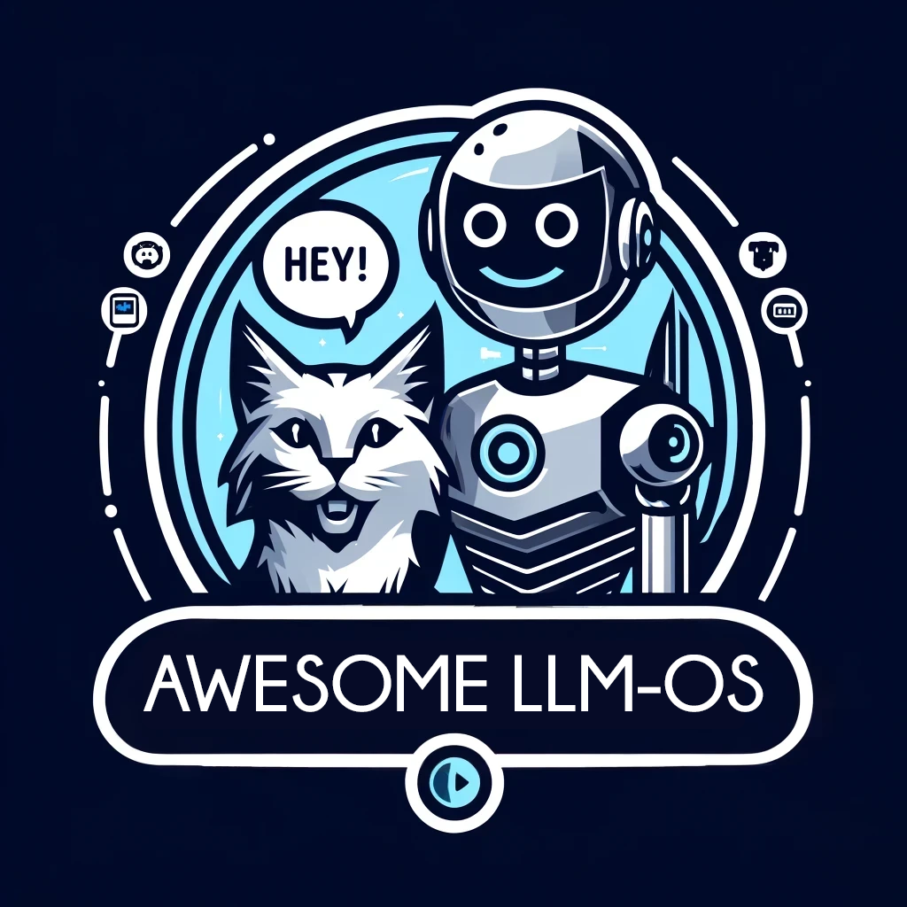

# Awesome LLM OS

An LLM OS is an operating system that utilizes large language models to interact with users in natural language, providing intuitive and intelligent assistance. This list compiles resources to help understand, develop, and explore the possibilities of LLM OS. The objective is to create a well-organized, community-driven repository of current, top-quality resources. This initiative aims to enhance practices within the LLM OS and related domains. 

This is a curated list of awesome resources, tools, frameworks, papers, projects and discussions related to the concept of Large Language Model Operating Systems (LLM OS). Explore the future of human-computer interaction with natural language interfaces powered by advanced AI.

I highly recommend that you take the time to watch [Andrej Karpathy](https://github.com/karpathy)'s [presentation on LLM OS](https://youtu.be/zjkBMFhNj_g?feature=shared&t=2536).

## Table of Contents
- [Research Papers](#research-papers)
- [Articles and Blog Posts](#articles-and-blog-posts)
- [Videos and Talks](#videos-and-talks)
- [Projects and Implementations](#projects-and-implementations)
- [Communities and Discussions](#communities-and-discussions)
- [Development Tools and Frameworks](#development-tools-and-frameworks)
- [Performance and Optimization](#performance-and-optimization)
- [Security](#security)
- [Deployment](#deployment)
- [Contributing](#contributing)
- [License](#license)

## Research Papers
- [AIOS: LLM Agent Operating System](https://arxiv.org/abs/2403.16971)
- [MemGPT: Towards LLMs as Operating Systems](https://arxiv.org/abs/2310.08560)

## Articles and Blog Posts
- [Illustrated LLM-OS](https://huggingface.co/blog/shivance/illustrated-llm-os)
- [Goodbye Windows, Hello LLMs: The Future of Operating Systems](https://medium.com/@ronaldmannak/goodbye-windows-hello-llms-the-future-of-operating-systems-7ba61ea03e8d)
- [GPT-4o](https://openai.com/index/hello-gpt-4o/)

## Videos and Talks
- [Intro to Large Language Models - Andrej Karpathy](https://www.youtube.com/watch?v=zjkBMFhNj_g)
- [Build the LLM OS Autonomous LLMs as the new Operating System - Phidata](https://www.youtube.com/watch?v=YMZm7LdGQp8)
- [Agent OS: LLM OS Micro Architecture for Composable, Reusable AI Agents - IndyDevDan](https://www.youtube.com/watch?v=8wSH4XukcH8)
- [OS-World: Improving LLM Agent Operating Systems!](https://www.youtube.com/watch?v=zm1_Huwb26I)
- [LLM OS with gpt-4o - Phidata](https://www.youtube.com/watch?v=6g2KLvwHZlU)

## Projects and Implementations
- [MemGPT](https://github.com/cpacker/MemGPT)
- [AIOS](https://github.com/agiresearch/AIOS)

## Communities and Discussions
- [LLM Agent Operating System - Rutgers University 2024 - AIOS](https://www.reddit.com/r/LocalLLaMA/comments/1bod1jt/llm_agent_operating_system_rutgers_university/)

## Development Tools and Frameworks
- 

## Performance and Optimization
- 

## Security
- 

## Deployment
- 

## Contributing
Contributions are more than welcome! 🌟

We highly encourage and appreciate contributions from the community. Whether it's new resources, improvements, or suggestions, your input helps make this list better. Please read the [contribution guidelines](contributing.md) before making a pull request.

## License

To the extent possible under law, [Bilal Onur Eskili](https://github.com/bilalonur) has waived all copyright and related or neighboring rights to this work.
